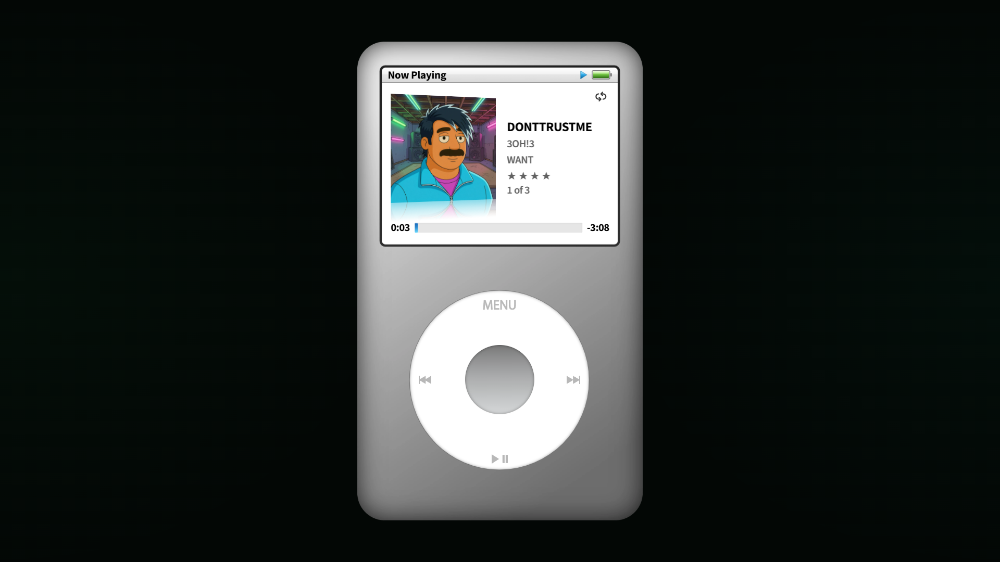
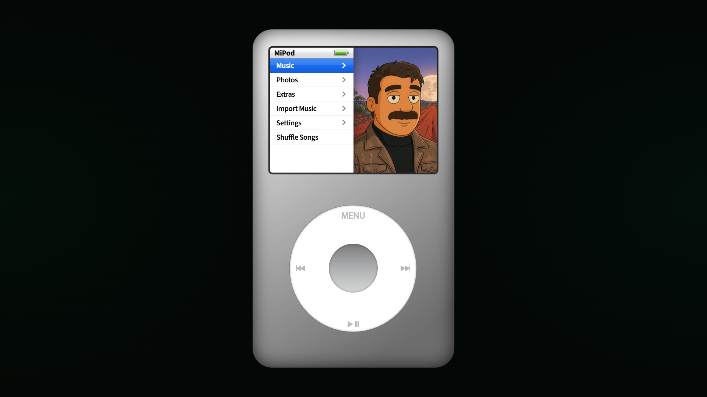

# MiPod Classic

MiPod Classic is a browser-based click-wheel music player built in [DoodleDev](https://doodledev.app/), with library browsing, playlists, album artwork, playback, and local music import.

[Open the DoodleDev Builds gallery](https://doodledev.app/builds/) · [Launch MiPod Classic](https://mitchivindesign.github.io/mipod/) · [Visit MitchIvin XP](https://mitchivin.com/)

## About this repository

This is the public project page for MiPod Classic. It contains project information and screenshots; the working product source and deployment are maintained privately.

The canonical shared device behavior, states, library, and media are maintained with MitchIvin XP. The standalone edition adds local import, its full-page presentation, and deployment packaging without forking those shared behaviors.

MiPod Classic is an independent creative project and is not affiliated with Apple.
